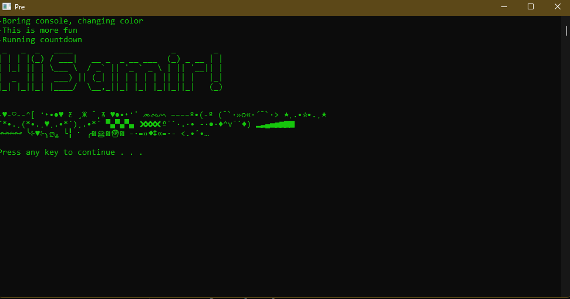

## Pre.py

### Purpose:

To open three programs, Throttlestop, MSI Afterburner, and Vibrance GUI to load my configurations (Undervolt/Overclock as well as custom NVDIA colour scheme) and decrease brightness of one of my monitors.
Script also saves the process ID of the processes into a text file after its run, which it checks for if run again, and if there are process IDs, it clears the process tree and restores brightness, also deletes the file to avoid confusion.

### Screenshot:

### Python libraries used:

- `subprocess` is used to run the programs
- `screen_brightness_control` is used to change the brightness of the monitor
- `time` is used to wait for the programs to load
- `os` is used to check if the file exists
- `sys` is used to exit the script
- `art` is used to display the title
- `psutil` is used to get the process ID of the programs

### Pre.bat

This simple batch file launches the python script, and if we right click and launch Pre.bat as administrator, it launches the script with admin privileges which is needed to run some programs (for Pre.py)
